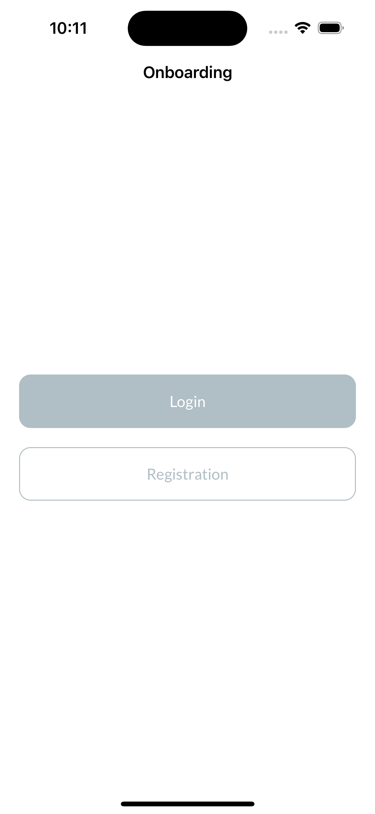
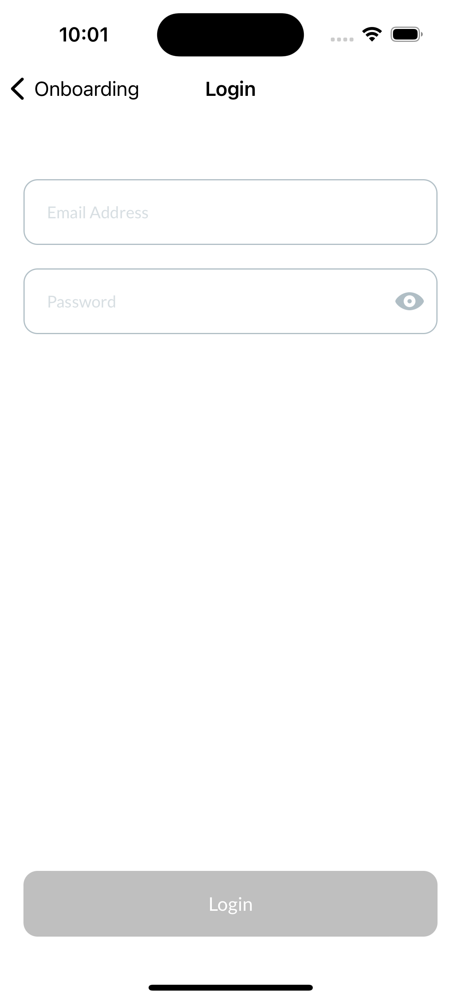
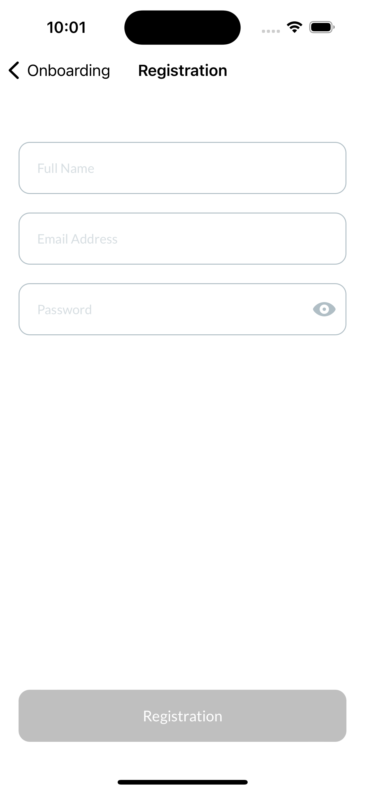
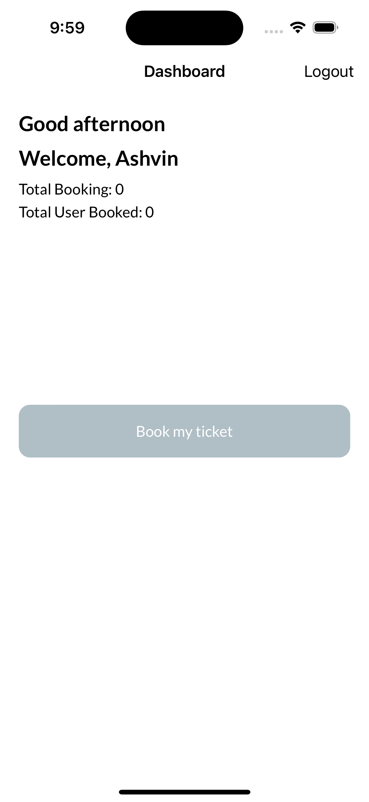
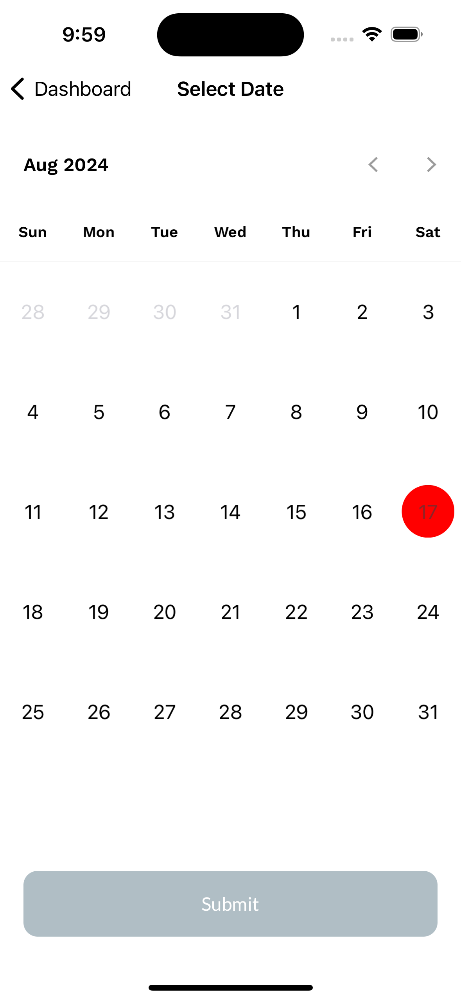
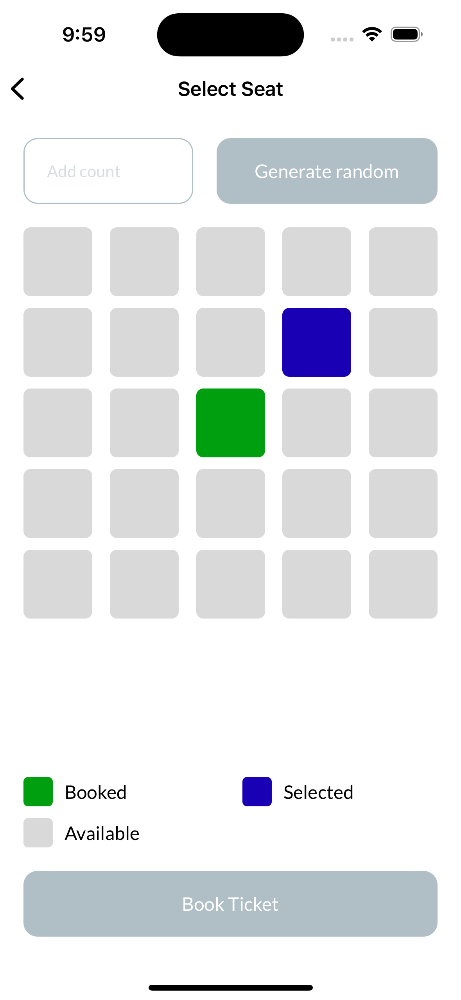

# iOS-TicketBooking-Viper
This repository contains a detailed implementation of a Movies Ticket Booking System app using the VIPER architecture in iOS. It leverages libraries and frameworks such as CoreData, UIKit, and more.

## Features
- **Account Registration:** Users can create a new account via the registration screen.
- **Dashboard:** Displays the logged-in user’s information, total seats booked by all users, and current user's bookings.
- **Login:** Existing users can log-in to access the dashboard.
- **Booking Tickets:** Users can select a date from the calendar, view seat availability, and book tickets.

## App Flow

**1. Registration Screen**
- Users create an account with their details.
- Upon successful registration, users are redirected to the Dashboard screen.

**2. Login Screen**
- Users can log in from this screen if they have login credentials.
- After logging in, users are redirected to the Dashboard screen.

**3. Dashboard Screen**
- Displays:
    - The logged-in user's information.
    - Total number of seats booked by all users.
    - The current user’s booking details.
- Users can initiate ticket booking from here by pressing the "Book My Ticket" button.

**4. Calendar Screen**
- Users select a date to view available bookings.
- Users are redirected to the Select Seats screen if seats are available for the selected date.
- If no seats are available, a "house full" error message is displayed.

**5. Select Seats Screen**
- Users can specify the number of tickets in the text field.
- The app automatically selects random seats based on the number of tickets.
- Users can press the "Generate Random" button to generate and display random seats in the text field and select them.

**6. Booking Confirmation**
- Users can finalize their booking by pressing the "Book Ticket" button.
- This action confirms and completes the ticket booking process.

## Screenshots for Application
<p align="center">
  
  
  
  
  
  
</p>
<br>
<be>

## Run Application 
1. Clone this repository.
    ```
    git clone git@github.com:AshvinGudaliya/iOS-TicketBooking-Viper
    ```

2. Open `TicketBooking.xcodeproj` in Xcode. 

3. Run

## Requirements

- Xcode 15.0+
- Swift 5.0+
- iOS 13.0+

## Contact

**Author:** Ashvin Gudaliya,

For any questions or feedback, please reach out to ashvinkgudaliya@gmail.com.
 
